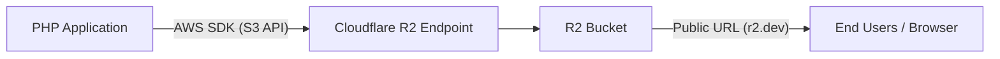

# Cloudflare R2 Bucket — Implementation Guide for PHP Projects

> A developer-ready reference document derived from the **SETTribe-AMS** production codebase. Follow these steps to integrate Cloudflare R2 object storage into any PHP project.

---

## Table of Contents

1. [Architecture Overview](#1-architecture-overview)
2. [Cloudflare Dashboard Setup](#2-cloudflare-dashboard-setup)
3. [Prerequisites & Dependencies](#3-prerequisites--dependencies)
4. [Environment Configuration](#4-environment-configuration)
5. [Core Implementation Files](#5-core-implementation-files)
6. [Usage Patterns](#6-usage-patterns)
7. [Retrieving & Displaying Files](#7-retrieving--displaying-files)
8. [File Listing & Counting](#8-file-listing--counting)
9. [Folder Organization Strategy](#9-folder-organization-strategy)
10. [Security Best Practices](#10-security-best-practices)
11. [Troubleshooting](#11-troubleshooting)
12. [Quick-Start Checklist](#12-quick-start-checklist)

---

## 1. Architecture Overview

Cloudflare R2 is an S3-compatible object storage service with **zero egress fees**. Because it speaks the S3 API, you use the official **AWS SDK for PHP** to interact with it.



| Component | Role |
|---|---|
| **AWS SDK for PHP** | Client library — sends S3-compatible API calls to R2 |
| **R2 Endpoint** | Your account-specific Cloudflare R2 API endpoint |
| **R2 Bucket** | The storage container holding your objects (files) |
| **Public URL (`r2.dev`)** | Cloudflare-provided public access URL for the bucket |

> [!IMPORTANT]
> R2 uses the **S3 API**, not a proprietary Cloudflare API. Any S3-compatible SDK or tool will work.

---

## 2. Cloudflare Dashboard Setup

### Step 1 — Create the R2 Bucket

1. Log into [Cloudflare Dashboard](https://dash.cloudflare.com/)
2. Navigate to **R2 Object Storage** in the sidebar
3. Click **Create bucket**
4. Enter a bucket name (e.g., `dev-ams-settribe`)
5. Select the **Automatic** location hint (or choose a region close to your users)
6. Click **Create bucket**

### Step 2 — Generate API Tokens

1. In the R2 section, go to **Manage R2 API Tokens** (or **Overview → Manage API Tokens**)
2. Click **Create API Token**
3. Set permissions:
   - **Object Read & Write** — for uploading and reading files
   - Optionally scope to a specific bucket for tighter security
4. Click **Create API Token**
5. **Copy and save** the following credentials immediately (they are shown only once):

| Credential | Example | Description |
|---|---|---|
| **Access Key ID** | `1f3b48c140fa6376...` | Public part of the key pair |
| **Secret Access Key** | `58182dbc7fb27ed8...` | Secret part — **never commit this** |
| **Endpoint URL** | `https://<ACCOUNT_ID>.r2.cloudflarestorage.com` | Your account-specific S3 endpoint |

### Step 3 — Enable Public Access (Optional)

If you need files to be publicly readable (e.g., for `` tags):

1. Go to your bucket → **Settings** tab
2. Under **Public Access**, enable the `r2.dev` subdomain
3. Copy the resulting **Public URL** (e.g., `https://pub-cf061a9b971a46b2860893f3f9debebb.r2.dev/`)

> [!WARNING]
> Enabling public access makes **all objects in the bucket** publicly readable. If you need selective access, use **pre-signed URLs** instead.

---

## 3. Prerequisites & Dependencies

### Install AWS SDK for PHP via Composer

```bash
composer require aws/aws-sdk-php:~3.297.0
```

This adds the dependency to your [`composer.json`](file:///c:/xampp/htdocs/repos/Dev-SETTribe-AMS/composer.json):

```json
{
    "require": {
        "aws/aws-sdk-php": "~3.297.0"
    }
}
```

### Required PHP Extensions

Ensure these are enabled in your `php.ini`:

```
extension=curl
extension=openssl
extension=mbstring
```

---

## 4. Environment Configuration

### 4.1 — Create `.env` File

Store all R2 credentials in a `.env` file at the project root. **Never hard-code credentials in PHP files.**

```env
# Cloudflare R2 / AWS S3 Configuration
R2_ACCESS_KEY_ID=your_access_key_id_here
R2_SECRET_ACCESS_KEY=your_secret_access_key_here
R2_ENDPOINT=https://YOUR_ACCOUNT_ID.r2.cloudflarestorage.com
R2_BUCKET_NAME=your-bucket-name
R2_PUBLIC_URL=https://pub-XXXXXXXXXXXXXXXXXXXX.r2.dev/
```

> [!CAUTION]
> **Add `.env` to your `.gitignore` immediately.** Leaking R2 credentials to a public repository can lead to data theft or unexpected billing.

```gitignore
# .gitignore
.env
```

### 4.2 — Create the `.env` Loader

Create a lightweight env loader at [`include/loadenv.php`](file:///c:/xampp/htdocs/repos/Dev-SETTribe-AMS/include/loadenv.php):

```php
<?php
function loadEnv($path) {
    if (!file_exists($path)) {
        return false;
    }

    $lines = file($path, FILE_IGNORE_NEW_LINES | FILE_SKIP_EMPTY_LINES);
    foreach ($lines as $line) {
        // Skip comment lines (starting with #)
        if (strpos(trim($line), '#') === 0) {
            continue;
        }

        // Split by the first '=' found
        list($name, $value) = explode('=', $line, 2);

        $name = trim($name);
        $value = trim($value);

        // Set the variable in the environment and $_ENV superglobal
        if (!array_key_exists($name, $_SERVER) && !array_key_exists($name, $_ENV)) {
            putenv(sprintf('%s=%s', $name, $value));
            $_ENV[$name] = $value;
        }
    }
}
```

> [!TIP]
> For production or larger projects, consider using the popular `vlucas/phpdotenv` package instead of a custom loader: `composer require vlucas/phpdotenv`.

---

## 5. Core Implementation Files

Create the R2 configuration and helper functions at `include/r2_config.php`. This is the **single source of truth** for all R2 operations.

Reference implementation: [`include/r2_config.php`](file:///c:/xampp/htdocs/repos/Dev-SETTribe-AMS/include/r2_config.php)

### 5.1 — R2 Client Factory

```php
<?php
require_once __DIR__ . '/../vendor/autoload.php';
require_once __DIR__ . '/loadenv.php';

// Load environment variables
loadEnv(__DIR__ . '/../.env');

use Aws\S3\S3Client;
use Aws\Exception\AwsException;

/**
 * Create and return an S3-compatible client configured for Cloudflare R2.
 *
 * Key differences from standard AWS S3:
 *   - 'region' must be 'auto' (R2 does not use AWS regions)
 *   - 'endpoint' must point to your Cloudflare R2 account URL
 */
function getR2Client()
{
    $accessKey = getenv('R2_ACCESS_KEY_ID') ?: ($_ENV['R2_ACCESS_KEY_ID'] ?? '');
    $secretKey = getenv('R2_SECRET_ACCESS_KEY') ?: ($_ENV['R2_SECRET_ACCESS_KEY'] ?? '');
    $endpoint  = getenv('R2_ENDPOINT') ?: ($_ENV['R2_ENDPOINT'] ?? '');

    $credentials = new Aws\Credentials\Credentials($accessKey, $secretKey);

    $options = [
        'region'      => 'auto',          // ← MUST be 'auto' for R2
        'endpoint'    => $endpoint,        // ← Your R2 account endpoint
        'version'     => 'latest',
        'credentials' => $credentials
    ];

    return new S3Client($options);
}
```

> [!IMPORTANT]
> **`'region' => 'auto'`** is mandatory for Cloudflare R2. Do NOT use a standard AWS region like `us-east-1`.

### 5.2 — Helper Functions

```php
/**
 * Get the configured R2 bucket name.
 */
function getR2BucketName()
{
    return getenv('R2_BUCKET_NAME') ?: ($_ENV['R2_BUCKET_NAME'] ?? '');
}

/**
 * Get the public base URL for the R2 bucket.
 */
function getR2PublicUrl()
{
    return getenv('R2_PUBLIC_URL') ?: ($_ENV['R2_PUBLIC_URL'] ?? '');
}
```

---

## 6. Usage Patterns

### 6.1 — Universal File Upload (from `$_FILES`)

This pattern is the standard for uploading any file (documents, images, selfies, etc.) to R2. It automatically validates the file using `validateFile()` before uploading.

```php
/**
 * Upload a file from $_FILES to R2 with validation.
 *
 * @param array       $file             $_FILES['input_name'] array
 * @param string      $folder           Target folder in the bucket (e.g., 'leave_docs/', 'selfies/')
 * @param string      $prefix           Prefix for the filename (default: '')
 * @param int|null    $maxSizeMB        Maximum allowed file size in MB
 * @param string|null $extraExtensions  Add-on extensions (comma separated)
 * @param string|null $onlyExtensions   Override extensions (comma separated)
 * @return string|null                  The object key on success, null on failure
 */
function uploadFileToR2($file, $folder = 'uploads/', $prefix = '', $maxSizeMB = null, $extraExtensions = null, $onlyExtensions = null)
{
    require_once __DIR__ . '/fileValidate.php';

    if (empty($file) || $file['error'] !== UPLOAD_ERR_OK) {
        error_log("R2 Upload failed: Invalid file upload array or upload error.");
        return null;
    }

    // Validate the file using fileValidate.php
    if (!validateFile($file['name'], $file['size'], $maxSizeMB, $extraExtensions, $onlyExtensions)) {
        error_log("R2 Upload failed: File validation failed for " . $file['name']);
        return null;
    }

    $client = getR2Client();
    $bucket = getR2BucketName();

    // Sanitize the original filename and build a unique target name
    $sanitized = preg_replace('/[^a-zA-Z0-9.\-]/', '_', basename($file['name']));
    $prefixStr = !empty($prefix) ? $prefix . "_" : "";
    $fileName  = $prefixStr . time() . "_" . rand(1000, 9999) . "_" . $sanitized;

    // Organize into folders
    $objectKey = rtrim($folder, '/') . '/' . $fileName;

    try {
        $client->putObject([
            'Bucket'     => $bucket,
            'Key'        => $objectKey,
            'SourceFile' => $file['tmp_name']
        ]);
        return $objectKey;
    } catch (AwsException $e) {
        error_log("R2 Upload failed: " . $e->getMessage());
        return null;
    }
}
```

**Calling this function** (from any form handler):

```php
if (!empty($_FILES['document']['name'])) {
    require_once '../include/r2_config.php';
    
    // Upload file to 'leave_docs/' folder, with a max size of 5MB
    $objectKey = uploadFileToR2($_FILES['document'], 'leave_docs/', 'doc', 5);

    if ($objectKey) {
        // Store $objectKey in the database (NOT the full URL)
        $stmt = $con->prepare("UPDATE leaves SET document_path = ? WHERE leave_id = ?");
        $stmt->bind_param("ss", $objectKey, $leaveId);
        $stmt->execute();
    } else {
        die('Upload or validation failed!');
    }
}
```

### 6.3 — Delete an Object

```php
/**
 * Delete a single object from R2.
 *
 * @param string $objectKey The key/path of the object to delete
 * @return bool             True on success, false on failure
 */
function deleteFromR2($objectKey)
{
    $client = getR2Client();
    $bucket = getR2BucketName();

    try {
        $client->deleteObject([
            'Bucket' => $bucket,
            'Key'    => $objectKey,
        ]);
        return true;
    } catch (AwsException $e) {
        error_log("R2 Delete failed: " . $e->getMessage());
        return false;
    }
}
```

### 6.4 — Generate a Pre-Signed URL (Temporary Access)

Use this for **private buckets** where you want to grant time-limited access to a specific object:

```php
/**
 * Generate a pre-signed URL for temporary access to a private object.
 *
 * @param string $objectKey The key/path of the object
 * @param int    $expiry    Expiry time in minutes (default: 60)
 * @return string           The pre-signed URL
 */
function getPreSignedUrl($objectKey, $expiry = 60)
{
    $client = getR2Client();
    $bucket = getR2BucketName();

    $cmd = $client->getCommand('GetObject', [
        'Bucket' => $bucket,
        'Key'    => $objectKey,
    ]);

    $request = $client->createPresignedRequest($cmd, "+{$expiry} minutes");
    return (string) $request->getUri();
}
```

---

## 7. Retrieving & Displaying Files

### Building the Public URL

When you store the **object key** in the database (recommended), build the full URL at display time:

```php
/**
 * Resolve an image path to a full URL — supports both R2 and legacy local paths.
 *
 * @param string $imageName The stored image path from the database
 * @param string $basePath  The local fallback base path
 * @return string            The complete URL to the image
 */
function getFileUrl($imageName, $basePath = '')
{
    if (empty($imageName)) return '';

    // Already a full URL (legacy data)
    if (strpos($imageName, 'http') === 0) return $imageName;

    // R2 object key (identified by the folder prefix)
    if (strpos($imageName, 'selfies/') === 0) {
        return rtrim(getR2PublicUrl(), '/') . '/' . ltrim($imageName, '/');
    }

    // Fallback: local file
    return rtrim($basePath, '/') . '/' . ltrim($imageName, '/');
}
```

### Using in HTML

```php
<?php
$imageUrl = getFileUrl($row['punchInImage'], '../uploads/punchIn/');
?>
"
     alt="Punch In Selfie"
     loading="lazy"
     width="150" />
```

---

## 8. File Listing & Counting

### Count Objects in a Folder

```php
/**
 * Count all files in the bucket (or within a specific folder/prefix).
 * Handles pagination automatically for buckets with 1000+ objects.
 *
 * @param string $prefix Folder prefix (e.g., 'selfies/42/')
 * @return int           Total file count
 */
function getR2FileCount($prefix = '')
{
    $client = getR2Client();
    $bucket = getR2BucketName();

    $params = ['Bucket' => $bucket];

    if (!empty($prefix)) {
        $params['Prefix'] = rtrim($prefix, '/') . '/';
    }

    $count = 0;

    try {
        // Paginator handles ListObjectsV2 pagination automatically
        $results = $client->getPaginator('ListObjectsV2', $params);

        foreach ($results as $result) {
            if (!empty($result['Contents'])) {
                $count += count($result['Contents']);
            }
        }

        return $count;
    } catch (AwsException $e) {
        error_log("R2 File Count failed: " . $e->getMessage());
        return 0;
    }
}

// Usage:
$totalFiles   = getR2FileCount();                // entire bucket
$userFiles    = getR2FileCount('selfies/42');     // specific user's folder
```

### List Objects in a Folder

```php
/**
 * List all objects under a given prefix.
 *
 * @param string $prefix Folder prefix
 * @param int    $limit  Max results (default: 100)
 * @return array         Array of object keys
 */
function listR2Objects($prefix = '', $limit = 100)
{
    $client = getR2Client();
    $bucket = getR2BucketName();

    $params = [
        'Bucket'  => $bucket,
        'MaxKeys' => $limit,
    ];

    if (!empty($prefix)) {
        $params['Prefix'] = rtrim($prefix, '/') . '/';
    }

    try {
        $result = $client->listObjectsV2($params);
        $objects = [];

        if (!empty($result['Contents'])) {
            foreach ($result['Contents'] as $object) {
                $objects[] = [
                    'key'          => $object['Key'],
                    'size'         => $object['Size'],
                    'lastModified' => $object['LastModified'],
                ];
            }
        }

        return $objects;
    } catch (AwsException $e) {
        error_log("R2 List failed: " . $e->getMessage());
        return [];
    }
}
```

---

## 9. Folder Organization Strategy

Organize objects using a **prefix-based folder structure**. R2 (like S3) doesn't have real folders — the `/` in the key creates a virtual hierarchy.

```
bucket-name/
├── selfies/
│   ├── <userId>/
│   │   ├── PI_1692345678_1234.jpg    ← Punch In selfie
│   │   └── PO_1692345678_5678.jpg    ← Punch Out selfie
├── leave_docs/
│   ├── 2026-08-24_14-30-00_medical_cert.pdf
│   └── 2026-08-20_09-15-00_prescription.jpg
├── profile_photos/
│   ├── <userId>.jpg
└── documents/
    └── <category>/
        └── <file>
```

### Naming Conventions

| Element | Convention | Example |
|---|---|---|
| **Folder prefix** | `snake_case/` | `leave_docs/`, `selfies/` |
| **Unique filename** | `<prefix>_<timestamp>_<random>.<ext>` | `PI_1692345678_1234.jpg` |
| **Sanitized uploads** | `<date>_<sanitized_name>.<ext>` | `2026-08-24_14-30-00_report.pdf` |

> [!TIP]
> Always sanitize uploaded filenames to prevent URL-encoding issues: `$sanitized = preg_replace('/[^a-zA-Z0-9.\-]/', '_', $filename);`

---

## 10. Security Best Practices

### ✅ Do

| Practice | Reason |
|---|---|
| Store credentials in `.env` only | Prevents accidental commits |
| Add `.env` to `.gitignore` | Protects secrets from version control |
| Validate file types and size **before** upload | Prevents malicious file injection |
| Sanitize filenames with regex | Prevents path traversal and URL issues |
| Store only the **object key** in the DB | Decouple storage URL from data |
| Use pre-signed URLs for private content | Time-limited, revocable access |

### ❌ Don't

| Anti-Pattern | Risk |
|---|---|
| Hard-code credentials in PHP files | Credential leak in version control |
| Set `ACL => 'public-read'` on sensitive files | Unrestricted public access |
| Skip file validation before upload | Allows uploading executable files |
| Store the full public URL in the DB | URL changes require DB migration |
| Use user-supplied filenames directly | Path traversal attacks |

---

## 11. Troubleshooting

### Common Errors & Solutions

| Error | Cause | Fix |
|---|---|---|
| `Error executing "PutObject"` | Invalid credentials or endpoint | Verify `.env` values; test with `curl` |
| `SignatureDoesNotMatch` | Wrong secret key or clock skew | Re-generate API token; sync server clock |
| `NoSuchBucket` | Bucket name mismatch | Confirm bucket name in Cloudflare dashboard |
| `AccessDenied` | API token lacks permissions | Ensure token has **Object Read & Write** |
| `cURL error 6: Could not resolve host` | DNS issue or wrong endpoint | Verify endpoint URL format |
| `RequestTimeTooSkewed` | Server clock is off by >15 min | Sync time with NTP (`w32tm /resync` on Windows) |
| Empty `$objectKey` returned | `$fileData` is empty or decode failed | Check base64 string has valid `data:image` header |

### Debugging Uploads

```php
try {
    $result = $client->putObject([...]);
    // Log the result for debugging
    error_log("R2 Upload Success: " . json_encode([
        'ObjectURL'  => $result['ObjectURL'] ?? 'N/A',
        'ETag'       => $result['ETag'] ?? 'N/A',
        'Key'        => $objectKey,
    ]));
} catch (AwsException $e) {
    error_log("R2 Error Code: " . $e->getAwsErrorCode());
    error_log("R2 Error Msg:  " . $e->getAwsErrorMessage());
    error_log("R2 Request ID: " . $e->getAwsRequestId());
}
```

### Testing Connection

Use this standalone script to verify your R2 configuration:

```php
<?php
require_once __DIR__ . '/include/r2_config.php';

echo "Testing R2 Connection...\n";

try {
    $client = getR2Client();
    $bucket = getR2BucketName();

    // List objects (empty result is fine — proves connectivity)
    $result = $client->listObjectsV2([
        'Bucket'  => $bucket,
        'MaxKeys' => 1,
    ]);

    echo "✅ Connection successful!\n";
    echo "Bucket: " . $bucket . "\n";
    echo "Objects found: " . count($result['Contents'] ?? []) . "\n";
} catch (Exception $e) {
    echo "❌ Connection failed: " . $e->getMessage() . "\n";
}
```

---

## 12. Quick-Start Checklist

Use this checklist when adding R2 to a new project:

- [ ] **Cloudflare Dashboard**: Create R2 bucket and generate API token
- [ ] **Composer**: `composer require aws/aws-sdk-php:~3.297.0`
- [ ] **`.env`**: Add `R2_ACCESS_KEY_ID`, `R2_SECRET_ACCESS_KEY`, `R2_ENDPOINT`, `R2_BUCKET_NAME`, `R2_PUBLIC_URL`
- [ ] **`.gitignore`**: Add `.env`
- [ ] **`include/loadenv.php`**: Create the env loader (or use `vlucas/phpdotenv`)
- [ ] **`include/r2_config.php`**: Create with `getR2Client()`, `getR2BucketName()`, `getR2PublicUrl()`
- [ ] **Upload function**: Implement `uploadFileToR2()` using `putObject`
- [ ] **URL resolver**: Implement `getFileUrl()` for hybrid local/R2 display
- [ ] **Database schema**: Store the **object key** (not the full URL)
- [ ] **Validation**: Add file type/size checks before upload
- [ ] **Error handling**: Wrap all R2 calls in `try/catch` with `error_log()`
- [ ] **Test**: Run the connection test script

---

## Appendix: Complete `r2_config.php` Template

Copy this file as your starting point for new projects:

```php
<?php
/**
 * ─────────────────────────────────────────────────────────────────────────────
 * r2_config.php — Cloudflare R2 Configuration & Helper Functions
 * ─────────────────────────────────────────────────────────────────────────────
 *
 * Prerequisites:
 *   composer require aws/aws-sdk-php:~3.297.0
 *
 * Required .env variables:
 *   R2_ACCESS_KEY_ID, R2_SECRET_ACCESS_KEY, R2_ENDPOINT,
 *   R2_BUCKET_NAME, R2_PUBLIC_URL
 */

require_once __DIR__ . '/../vendor/autoload.php';
require_once __DIR__ . '/loadenv.php';

loadEnv(__DIR__ . '/../.env');

use Aws\S3\S3Client;
use Aws\Exception\AwsException;

// ── Client & Config ────────────────────────────────────────────────────────

function getR2Client()
{
    $credentials = new Aws\Credentials\Credentials(
        getenv('R2_ACCESS_KEY_ID')     ?: ($_ENV['R2_ACCESS_KEY_ID'] ?? ''),
        getenv('R2_SECRET_ACCESS_KEY') ?: ($_ENV['R2_SECRET_ACCESS_KEY'] ?? '')
    );

    return new S3Client([
        'region'      => 'auto',
        'endpoint'    => getenv('R2_ENDPOINT') ?: ($_ENV['R2_ENDPOINT'] ?? ''),
        'version'     => 'latest',
        'credentials' => $credentials,
    ]);
}

function getR2BucketName()
{
    return getenv('R2_BUCKET_NAME') ?: ($_ENV['R2_BUCKET_NAME'] ?? '');
}

function getR2PublicUrl()
{
    return getenv('R2_PUBLIC_URL') ?: ($_ENV['R2_PUBLIC_URL'] ?? '');
}

// ── Upload (Universal from $_FILES) ──────────────────────────────────────────

function uploadFileToR2($file, $folder = 'uploads/', $prefix = '', $maxSizeMB = null, $extraExtensions = null, $onlyExtensions = null)
{
    require_once __DIR__ . '/fileValidate.php';

    if (empty($file) || $file['error'] !== UPLOAD_ERR_OK) {
        return null;
    }

    if (!validateFile($file['name'], $file['size'], $maxSizeMB, $extraExtensions, $onlyExtensions)) {
        return null;
    }

    $sanitized = preg_replace('/[^a-zA-Z0-9.\-]/', '_', basename($file['name']));
    $prefixStr = !empty($prefix) ? $prefix . "_" : "";
    $objectKey = rtrim($folder, '/') . '/' . $prefixStr . time() . '_' . rand(1000, 9999) . '_' . $sanitized;

    try {
        getR2Client()->putObject([
            'Bucket'     => getR2BucketName(),
            'Key'        => $objectKey,
            'SourceFile' => $file['tmp_name'],
        ]);
        return $objectKey;
    } catch (AwsException $e) {
        error_log("R2 Upload failed: " . $e->getMessage());
        return null;
    }
}

// ── Delete ─────────────────────────────────────────────────────────────────

function deleteFromR2($objectKey)
{
    try {
        getR2Client()->deleteObject([
            'Bucket' => getR2BucketName(),
            'Key'    => $objectKey,
        ]);
        return true;
    } catch (AwsException $e) {
        error_log("R2 Delete failed: " . $e->getMessage());
        return false;
    }
}

// ── Pre-Signed URL ─────────────────────────────────────────────────────────

function getPreSignedUrl($objectKey, $expiryMinutes = 60)
{
    $cmd = getR2Client()->getCommand('GetObject', [
        'Bucket' => getR2BucketName(),
        'Key'    => $objectKey,
    ]);

    $request = getR2Client()->createPresignedRequest($cmd, "+{$expiryMinutes} minutes");
    return (string) $request->getUri();
}

// ── Public URL Builder ─────────────────────────────────────────────────────

function getR2FileUrl($objectKey)
{
    if (empty($objectKey)) return '';
    return rtrim(getR2PublicUrl(), '/') . '/' . ltrim($objectKey, '/');
}

// ── File Count ─────────────────────────────────────────────────────────────

function getR2FileCount($prefix = '')
{
    $params = ['Bucket' => getR2BucketName()];
    if (!empty($prefix)) {
        $params['Prefix'] = rtrim($prefix, '/') . '/';
    }

    $count = 0;

    try {
        $results = getR2Client()->getPaginator('ListObjectsV2', $params);
        foreach ($results as $result) {
            if (!empty($result['Contents'])) {
                $count += count($result['Contents']);
            }
        }
        return $count;
    } catch (AwsException $e) {
        error_log("R2 File Count failed: " . $e->getMessage());
        return 0;
    }
}
?>
```
